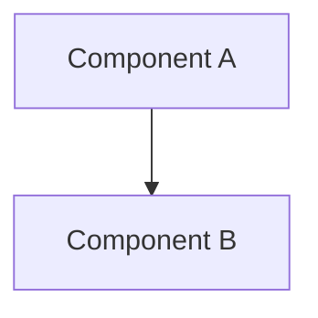

# View name, eg. "Logical view"

- Last updated: YYYY-MM-DD

## Purpose

One or two sentences covering which question this view answers, and for whom.
If it overlaps another view, say where the boundary lies.

## Overview

The view itself, in the present tense. Describe what exists, not what is
planned and not why it was chosen. Cross-reference to the relevant ADRs for
rationale.

## Diagram

Embed the diagram, or link to it if it lives alongside this file. Mermaid is
preferred, since it diffs cleanly in version control and is widely supported
(eg. in Markdown preview in many code editors and on GitHub).

Every element in the diagram MUST be named in the prose below, and every
element named in the prose MUST appear in the diagram.

## Elements

One short entry per element in the view: what it is, and what it is
responsible for.

- **Element name** \
  Its responsibility, in one or two sentences.

- **Element name** \
  Its responsibility, in one or two sentences.

## Notes

Anything a reader needs to interpret this view correctly: known simplifications
made for clarity, parts deliberately not shown, or areas where the
implementation is more subtle than the diagram suggests.
