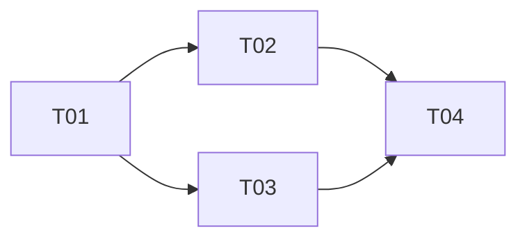

# Plan title, eg. "Checkout hardening"

- Authors: Your Name [@your-github-handle], ...
- Created: YYYY-MM-DD
- Last updated: YYYY-MM-DD
- Plan PR: #...

## Status

DRAFT | PLANNED | IN PROGRESS | DONE | ABANDONED

## References

Link out to the artifacts this plan implements.

- Implements: [spec](../../specs/), ...
- Informed by: [ADR 0001](../../decisions/), ...
- Targets design: [view](../../design/), ...

## Summary

A short, single-paragraph statement of what this plan delivers and why it is
being undertaken now. What does "done" look like?

## Scope

What is included in this plan and — just as important — what is explicitly out
of scope. Name the boundaries so the breakdown below can be judged complete.

## Approach

A short narrative of the implementation strategy: the order of attack, the
sequencing rationale, any phasing (eg. behind a feature flag, staged rollout),
and the key risks or unknowns that shape the plan. This is the prose that the
task breakdown makes concrete.

## Task breakdown

Decompose the plan into units of work. Link out to concrete issues or pull
requests — these track the live status of each task. Keep `Depends on`
accurate; it is what the dependency graph is built from.

| ID  | Task                   | Tracker | Depends on |
| --- | ---------------------- | ------- | ---------- |
| T01 | Short imperative title | #NN     | —          |
| T02 | Short imperative title | #NN     | T01        |
| T03 | Short imperative title | #NN     | T01        |
| T04 | Short imperative title | #NN     | T02, T03   |

## Dependency graph

## Open questions

Unresolved questions, decisions deferred, or items parked as out-of-scope that
will need a plan of their own later.
